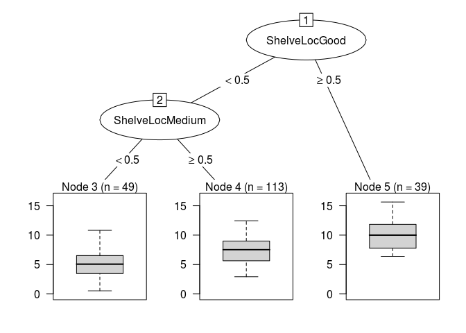

Homework 4: Bags, Forests, Boosts, oh my
================
Mustafa Kammar
2/28/2019

Problem 1
---------

Problem 7 from Chapter 8 in the text. To be specific, please use a sequence of `ntree` from 25 to 500 in steps of 25 and `mtry` from 3 to 9 for by 1.

Answer 1
--------

``` r
set.seed(1234)
df <- tbl_df(Boston)

for (k in 1:20){
  inTraining <- createDataPartition(df$medv, p = .75, list = F)
  training <- df[inTraining, ]
  testing <- df[-inTraining, ]
  mtry <- c(3:9)
  ntree <- seq(25, 500, len = 20)
  results <- tibble(trial = rep(NA, 140),
  mtry = rep(NA, 140),
  ntree = rep(NA, 140),
  mse = rep(NA, 140)) 
  for(i in 1:7){
    cat(sprintf('Trial: %s, mtry: %s --- %s\n', k, mtry[i], Sys.time()))
    for(j in 1:20){ 
      rf_train <- randomForest(medv ~ .,
                               data = training,
                               mtry = mtry[i],
                               ntree = ntree[j])
      mse <- mean((predict(rf_train, newdata = testing) - testing$medv)^2)
      results[(i-1)*20 + j, ] <- c(k, mtry[i], ntree[j], mse)
    }
  }
  if(exists("results_total")){
  results_total <- bind_rows(results_total, results)
  }
  else(
  results_total <- results
  )
}
```

    ## Trial: 1, mtry: 3 --- 2019-03-10 22:38:41
    ## Trial: 1, mtry: 4 --- 2019-03-10 22:38:46
    ## Trial: 1, mtry: 5 --- 2019-03-10 22:38:52
    ## Trial: 1, mtry: 6 --- 2019-03-10 22:38:58
    ## Trial: 1, mtry: 7 --- 2019-03-10 22:39:06
    ## Trial: 1, mtry: 8 --- 2019-03-10 22:39:14
    ## Trial: 1, mtry: 9 --- 2019-03-10 22:39:23
    ## Trial: 2, mtry: 3 --- 2019-03-10 22:39:34
    ## Trial: 2, mtry: 4 --- 2019-03-10 22:39:38
    ## Trial: 2, mtry: 5 --- 2019-03-10 22:39:44
    ## Trial: 2, mtry: 6 --- 2019-03-10 22:39:50
    ## Trial: 2, mtry: 7 --- 2019-03-10 22:39:58
    ## Trial: 2, mtry: 8 --- 2019-03-10 22:40:07
    ## Trial: 2, mtry: 9 --- 2019-03-10 22:40:16
    ## Trial: 3, mtry: 3 --- 2019-03-10 22:40:26
    ## Trial: 3, mtry: 4 --- 2019-03-10 22:40:31
    ## Trial: 3, mtry: 5 --- 2019-03-10 22:40:36
    ## Trial: 3, mtry: 6 --- 2019-03-10 22:40:43
    ## Trial: 3, mtry: 7 --- 2019-03-10 22:40:50
    ## Trial: 3, mtry: 8 --- 2019-03-10 22:40:58
    ## Trial: 3, mtry: 9 --- 2019-03-10 22:41:08
    ## Trial: 4, mtry: 3 --- 2019-03-10 22:41:18
    ## Trial: 4, mtry: 4 --- 2019-03-10 22:41:23
    ## Trial: 4, mtry: 5 --- 2019-03-10 22:41:28
    ## Trial: 4, mtry: 6 --- 2019-03-10 22:41:35
    ## Trial: 4, mtry: 7 --- 2019-03-10 22:41:43
    ## Trial: 4, mtry: 8 --- 2019-03-10 22:41:51
    ## Trial: 4, mtry: 9 --- 2019-03-10 22:42:01
    ## Trial: 5, mtry: 3 --- 2019-03-10 22:42:12
    ## Trial: 5, mtry: 4 --- 2019-03-10 22:42:16
    ## Trial: 5, mtry: 5 --- 2019-03-10 22:42:22
    ## Trial: 5, mtry: 6 --- 2019-03-10 22:42:28
    ## Trial: 5, mtry: 7 --- 2019-03-10 22:42:36
    ## Trial: 5, mtry: 8 --- 2019-03-10 22:42:44
    ## Trial: 5, mtry: 9 --- 2019-03-10 22:42:54
    ## Trial: 6, mtry: 3 --- 2019-03-10 22:43:04
    ## Trial: 6, mtry: 4 --- 2019-03-10 22:43:09
    ## Trial: 6, mtry: 5 --- 2019-03-10 22:43:14
    ## Trial: 6, mtry: 6 --- 2019-03-10 22:43:21
    ## Trial: 6, mtry: 7 --- 2019-03-10 22:43:28
    ## Trial: 6, mtry: 8 --- 2019-03-10 22:43:37
    ## Trial: 6, mtry: 9 --- 2019-03-10 22:43:46
    ## Trial: 7, mtry: 3 --- 2019-03-10 22:43:56
    ## Trial: 7, mtry: 4 --- 2019-03-10 22:44:01
    ## Trial: 7, mtry: 5 --- 2019-03-10 22:44:06
    ## Trial: 7, mtry: 6 --- 2019-03-10 22:44:13
    ## Trial: 7, mtry: 7 --- 2019-03-10 22:44:20
    ## Trial: 7, mtry: 8 --- 2019-03-10 22:44:29
    ## Trial: 7, mtry: 9 --- 2019-03-10 22:44:38
    ## Trial: 8, mtry: 3 --- 2019-03-10 22:44:48
    ## Trial: 8, mtry: 4 --- 2019-03-10 22:44:53
    ## Trial: 8, mtry: 5 --- 2019-03-10 22:44:58
    ## Trial: 8, mtry: 6 --- 2019-03-10 22:45:05
    ## Trial: 8, mtry: 7 --- 2019-03-10 22:45:12
    ## Trial: 8, mtry: 8 --- 2019-03-10 22:45:21
    ## Trial: 8, mtry: 9 --- 2019-03-10 22:45:30
    ## Trial: 9, mtry: 3 --- 2019-03-10 22:45:40
    ## Trial: 9, mtry: 4 --- 2019-03-10 22:45:45
    ## Trial: 9, mtry: 5 --- 2019-03-10 22:45:50
    ## Trial: 9, mtry: 6 --- 2019-03-10 22:45:57
    ## Trial: 9, mtry: 7 --- 2019-03-10 22:46:04
    ## Trial: 9, mtry: 8 --- 2019-03-10 22:46:12
    ## Trial: 9, mtry: 9 --- 2019-03-10 22:46:21
    ## Trial: 10, mtry: 3 --- 2019-03-10 22:46:31
    ## Trial: 10, mtry: 4 --- 2019-03-10 22:46:36
    ## Trial: 10, mtry: 5 --- 2019-03-10 22:46:42
    ## Trial: 10, mtry: 6 --- 2019-03-10 22:46:48
    ## Trial: 10, mtry: 7 --- 2019-03-10 22:46:56
    ## Trial: 10, mtry: 8 --- 2019-03-10 22:47:04
    ## Trial: 10, mtry: 9 --- 2019-03-10 22:47:14
    ## Trial: 11, mtry: 3 --- 2019-03-10 22:47:24
    ## Trial: 11, mtry: 4 --- 2019-03-10 22:47:29
    ## Trial: 11, mtry: 5 --- 2019-03-10 22:47:34
    ## Trial: 11, mtry: 6 --- 2019-03-10 22:47:41
    ## Trial: 11, mtry: 7 --- 2019-03-10 22:47:49
    ## Trial: 11, mtry: 8 --- 2019-03-10 22:47:57
    ## Trial: 11, mtry: 9 --- 2019-03-10 22:48:07
    ## Trial: 12, mtry: 3 --- 2019-03-10 22:48:17
    ## Trial: 12, mtry: 4 --- 2019-03-10 22:48:22
    ## Trial: 12, mtry: 5 --- 2019-03-10 22:48:27
    ## Trial: 12, mtry: 6 --- 2019-03-10 22:48:34
    ## Trial: 12, mtry: 7 --- 2019-03-10 22:48:42
    ## Trial: 12, mtry: 8 --- 2019-03-10 22:48:50
    ## Trial: 12, mtry: 9 --- 2019-03-10 22:49:00
    ## Trial: 13, mtry: 3 --- 2019-03-10 22:49:10
    ## Trial: 13, mtry: 4 --- 2019-03-10 22:49:14
    ## Trial: 13, mtry: 5 --- 2019-03-10 22:49:20
    ## Trial: 13, mtry: 6 --- 2019-03-10 22:49:26
    ## Trial: 13, mtry: 7 --- 2019-03-10 22:49:34
    ## Trial: 13, mtry: 8 --- 2019-03-10 22:49:42
    ## Trial: 13, mtry: 9 --- 2019-03-10 22:49:52
    ## Trial: 14, mtry: 3 --- 2019-03-10 22:50:02
    ## Trial: 14, mtry: 4 --- 2019-03-10 22:50:07
    ## Trial: 14, mtry: 5 --- 2019-03-10 22:50:12
    ## Trial: 14, mtry: 6 --- 2019-03-10 22:50:19
    ## Trial: 14, mtry: 7 --- 2019-03-10 22:50:26
    ## Trial: 14, mtry: 8 --- 2019-03-10 22:50:34
    ## Trial: 14, mtry: 9 --- 2019-03-10 22:50:44
    ## Trial: 15, mtry: 3 --- 2019-03-10 22:50:53
    ## Trial: 15, mtry: 4 --- 2019-03-10 22:50:58
    ## Trial: 15, mtry: 5 --- 2019-03-10 22:51:04
    ## Trial: 15, mtry: 6 --- 2019-03-10 22:51:10
    ## Trial: 15, mtry: 7 --- 2019-03-10 22:51:18
    ## Trial: 15, mtry: 8 --- 2019-03-10 22:51:26
    ## Trial: 15, mtry: 9 --- 2019-03-10 22:51:35
    ## Trial: 16, mtry: 3 --- 2019-03-10 22:51:46
    ## Trial: 16, mtry: 4 --- 2019-03-10 22:51:50
    ## Trial: 16, mtry: 5 --- 2019-03-10 22:51:56
    ## Trial: 16, mtry: 6 --- 2019-03-10 22:52:02
    ## Trial: 16, mtry: 7 --- 2019-03-10 22:52:10
    ## Trial: 16, mtry: 8 --- 2019-03-10 22:52:18
    ## Trial: 16, mtry: 9 --- 2019-03-10 22:52:28
    ## Trial: 17, mtry: 3 --- 2019-03-10 22:52:38
    ## Trial: 17, mtry: 4 --- 2019-03-10 22:52:42
    ## Trial: 17, mtry: 5 --- 2019-03-10 22:52:48
    ## Trial: 17, mtry: 6 --- 2019-03-10 22:52:55
    ## Trial: 17, mtry: 7 --- 2019-03-10 22:53:02
    ## Trial: 17, mtry: 8 --- 2019-03-10 22:53:10
    ## Trial: 17, mtry: 9 --- 2019-03-10 22:53:20
    ## Trial: 18, mtry: 3 --- 2019-03-10 22:53:30
    ## Trial: 18, mtry: 4 --- 2019-03-10 22:53:34
    ## Trial: 18, mtry: 5 --- 2019-03-10 22:53:40
    ## Trial: 18, mtry: 6 --- 2019-03-10 22:53:47
    ## Trial: 18, mtry: 7 --- 2019-03-10 22:53:54
    ## Trial: 18, mtry: 8 --- 2019-03-10 22:54:03
    ## Trial: 18, mtry: 9 --- 2019-03-10 22:54:12
    ## Trial: 19, mtry: 3 --- 2019-03-10 22:54:23
    ## Trial: 19, mtry: 4 --- 2019-03-10 22:54:27
    ## Trial: 19, mtry: 5 --- 2019-03-10 22:54:33
    ## Trial: 19, mtry: 6 --- 2019-03-10 22:54:39
    ## Trial: 19, mtry: 7 --- 2019-03-10 22:54:47
    ## Trial: 19, mtry: 8 --- 2019-03-10 22:54:55
    ## Trial: 19, mtry: 9 --- 2019-03-10 22:55:04
    ## Trial: 20, mtry: 3 --- 2019-03-10 22:55:15
    ## Trial: 20, mtry: 4 --- 2019-03-10 22:55:19
    ## Trial: 20, mtry: 5 --- 2019-03-10 22:55:25
    ## Trial: 20, mtry: 6 --- 2019-03-10 22:55:31
    ## Trial: 20, mtry: 7 --- 2019-03-10 22:55:39
    ## Trial: 20, mtry: 8 --- 2019-03-10 22:55:47
    ## Trial: 20, mtry: 9 --- 2019-03-10 22:55:57

Problem 2
---------

Problem 8 from Chapter 8 in the text. Set your seed with 9823 and split into train/test using 50% of your data in each split. In addition to parts (a) - (e), do the following:

1.  Fit a gradient-boosted tree to the training data and report the estimated test MSE.
2.  Fit a multiple regression model to the training data and report the estimated test MSE
3.  Summarize your results.

``` r
#a
set.seed(9823)
df<- tbl_df(Carseats)
inTraining <- createDataPartition(df$Sales, p=.50, list= F)
training <- df[inTraining, ]
testing <- df[-inTraining, ]
```

``` r
#b
tree_carseats <- rpart::rpart(Sales ~ ., 
                              data = training,
                              control = rpart.control(minsplit = 20))
summary(tree_carseats)
```

    ## Call:
    ## rpart::rpart(formula = Sales ~ ., data = training, control = rpart.control(minsplit = 20))
    ##   n= 201 
    ## 
    ##            CP nsplit rel error    xerror       xstd
    ## 1  0.23155949      0 1.0000000 1.0173468 0.09708974
    ## 2  0.12226232      1 0.7684405 0.8555409 0.07828876
    ## 3  0.09172973      2 0.6461782 0.7218100 0.06677113
    ## 4  0.03533612      3 0.5544484 0.6239798 0.05599835
    ## 5  0.03433475      4 0.5191123 0.7008466 0.06537458
    ## 6  0.03003688      5 0.4847776 0.7115057 0.06797243
    ## 7  0.02823833      6 0.4547407 0.6966850 0.06851981
    ## 8  0.02671147      7 0.4265024 0.7006259 0.06910021
    ## 9  0.02151143      8 0.3997909 0.6807879 0.06912370
    ## 10 0.01799895      9 0.3782795 0.7180768 0.07159743
    ## 11 0.01200941     11 0.3422816 0.7059585 0.06945401
    ## 12 0.01033541     12 0.3302722 0.7122929 0.07028484
    ## 13 0.01000000     13 0.3199367 0.7076406 0.07023507
    ## 
    ## Variable importance
    ##   ShelveLoc       Price   CompPrice         Age  Population   Education 
    ##          41          23          11           7           5           5 
    ## Advertising      Income 
    ##           4           4 
    ## 
    ## Node number 1: 201 observations,    complexity param=0.2315595
    ##   mean=7.465721, MSE=7.428204 
    ##   left son=2 (162 obs) right son=3 (39 obs)
    ##   Primary splits:
    ##       ShelveLoc   splits as  LRL,       improve=0.23155950, (0 missing)
    ##       Price       < 129.5 to the right, improve=0.13414320, (0 missing)
    ##       Advertising < 13.5  to the left,  improve=0.09155010, (0 missing)
    ##       Age         < 61.5  to the right, improve=0.05517630, (0 missing)
    ##       US          splits as  LR,        improve=0.03545178, (0 missing)
    ## 
    ## Node number 2: 162 observations,    complexity param=0.1222623
    ##   mean=6.822222, MSE=5.749911 
    ##   left son=4 (49 obs) right son=5 (113 obs)
    ##   Primary splits:
    ##       ShelveLoc   splits as  L-R,       improve=0.19597310, (0 missing)
    ##       Price       < 105.5 to the right, improve=0.18264610, (0 missing)
    ##       Advertising < 11.5  to the left,  improve=0.07161144, (0 missing)
    ##       Age         < 63.5  to the right, improve=0.05718564, (0 missing)
    ##       Income      < 116.5 to the left,  improve=0.04340843, (0 missing)
    ##   Surrogate splits:
    ##       CompPrice  < 93.5  to the left,  agree=0.704, adj=0.02, (0 split)
    ##       Population < 14.5  to the left,  agree=0.704, adj=0.02, (0 split)
    ## 
    ## Node number 3: 39 observations,    complexity param=0.03533612
    ##   mean=10.13872, MSE=5.534591 
    ##   left son=6 (13 obs) right son=7 (26 obs)
    ##   Primary splits:
    ##       Price       < 127.5 to the right, improve=0.2444267, (0 missing)
    ##       US          splits as  LR,        improve=0.1751606, (0 missing)
    ##       Advertising < 0.5   to the left,  improve=0.1675706, (0 missing)
    ##       Education   < 11.5  to the right, improve=0.1537685, (0 missing)
    ##       Population  < 356   to the left,  improve=0.1463307, (0 missing)
    ##   Surrogate splits:
    ##       Income    < 30.5  to the left,  agree=0.744, adj=0.231, (0 split)
    ##       CompPrice < 149   to the right, agree=0.718, adj=0.154, (0 split)
    ##       Age       < 34    to the left,  agree=0.718, adj=0.154, (0 split)
    ## 
    ## Node number 4: 49 observations,    complexity param=0.03003688
    ##   mean=5.210204, MSE=4.903508 
    ##   left son=8 (35 obs) right son=9 (14 obs)
    ##   Primary splits:
    ##       Price       < 102.5 to the right, improve=0.18665160, (0 missing)
    ##       Income      < 95.5  to the left,  improve=0.18458130, (0 missing)
    ##       Education   < 11.5  to the left,  improve=0.13839380, (0 missing)
    ##       Population  < 185.5 to the left,  improve=0.12645500, (0 missing)
    ##       Advertising < 11.5  to the left,  improve=0.07818734, (0 missing)
    ##   Surrogate splits:
    ##       CompPrice  < 112.5 to the right, agree=0.816, adj=0.357, (0 split)
    ##       Age        < 75.5  to the left,  agree=0.776, adj=0.214, (0 split)
    ##       Income     < 27    to the right, agree=0.755, adj=0.143, (0 split)
    ##       Population < 496.5 to the left,  agree=0.735, adj=0.071, (0 split)
    ## 
    ## Node number 5: 113 observations,    complexity param=0.09172973
    ##   mean=7.521239, MSE=4.501483 
    ##   left son=10 (73 obs) right son=11 (40 obs)
    ##   Primary splits:
    ##       Price       < 105.5 to the right, improve=0.26925010, (0 missing)
    ##       Income      < 57.5  to the left,  improve=0.11786330, (0 missing)
    ##       Age         < 60.5  to the right, improve=0.11445890, (0 missing)
    ##       Advertising < 6.5   to the left,  improve=0.09124711, (0 missing)
    ##       CompPrice   < 115.5 to the left,  improve=0.04636677, (0 missing)
    ##   Surrogate splits:
    ##       CompPrice  < 120.5 to the right, agree=0.699, adj=0.15, (0 split)
    ##       Population < 80    to the right, agree=0.681, adj=0.10, (0 split)
    ##       Income     < 118.5 to the left,  agree=0.664, adj=0.05, (0 split)
    ## 
    ## Node number 6: 13 observations
    ##   mean=8.493846, MSE=3.219254 
    ## 
    ## Node number 7: 26 observations,    complexity param=0.02671147
    ##   mean=10.96115, MSE=4.663056 
    ##   left son=14 (17 obs) right son=15 (9 obs)
    ##   Primary splits:
    ##       Education   < 11.5  to the right, improve=0.3289528, (0 missing)
    ##       CompPrice   < 120.5 to the left,  improve=0.2320853, (0 missing)
    ##       Advertising < 0.5   to the left,  improve=0.1510274, (0 missing)
    ##       Price       < 108.5 to the right, improve=0.1324465, (0 missing)
    ##       Population  < 312.5 to the left,  improve=0.1093973, (0 missing)
    ##   Surrogate splits:
    ##       CompPrice  < 135   to the left,  agree=0.769, adj=0.333, (0 split)
    ##       Price      < 93.5  to the right, agree=0.769, adj=0.333, (0 split)
    ##       Population < 416   to the left,  agree=0.731, adj=0.222, (0 split)
    ##       Income     < 36.5  to the right, agree=0.692, adj=0.111, (0 split)
    ## 
    ## Node number 8: 35 observations,    complexity param=0.02151143
    ##   mean=4.605143, MSE=3.748665 
    ##   left son=16 (27 obs) right son=17 (8 obs)
    ##   Primary splits:
    ##       CompPrice < 137.5 to the left,  improve=0.2447961, (0 missing)
    ##       Price     < 143.5 to the right, improve=0.1786213, (0 missing)
    ##       Education < 11.5  to the left,  improve=0.1692974, (0 missing)
    ##       Age       < 44    to the right, improve=0.1435586, (0 missing)
    ##       Income    < 58.5  to the right, improve=0.1297241, (0 missing)
    ##   Surrogate splits:
    ##       Income    < 41    to the right, agree=0.8, adj=0.125, (0 split)
    ##       Education < 17.5  to the left,  agree=0.8, adj=0.125, (0 split)
    ## 
    ## Node number 9: 14 observations
    ##   mean=6.722857, MSE=4.587249 
    ## 
    ## Node number 10: 73 observations,    complexity param=0.02823833
    ##   mean=6.706301, MSE=3.290895 
    ##   left son=20 (59 obs) right son=21 (14 obs)
    ##   Primary splits:
    ##       Advertising < 13.5  to the left,  improve=0.17550200, (0 missing)
    ##       Income      < 59    to the left,  improve=0.13442920, (0 missing)
    ##       CompPrice   < 121.5 to the left,  improve=0.13058810, (0 missing)
    ##       Age         < 48.5  to the right, improve=0.12723440, (0 missing)
    ##       Price       < 136   to the right, improve=0.04860137, (0 missing)
    ## 
    ## Node number 11: 40 observations,    complexity param=0.03433475
    ##   mean=9.0085, MSE=3.286838 
    ##   left son=22 (27 obs) right son=23 (13 obs)
    ##   Primary splits:
    ##       Age         < 50.5  to the right, improve=0.3899200, (0 missing)
    ##       CompPrice   < 117.5 to the left,  improve=0.3136527, (0 missing)
    ##       Advertising < 5.5   to the left,  improve=0.1404600, (0 missing)
    ##       Income      < 55    to the left,  improve=0.1330976, (0 missing)
    ##       Price       < 96.5  to the right, improve=0.1321742, (0 missing)
    ##   Surrogate splits:
    ##       CompPrice   < 125.5 to the left,  agree=0.775, adj=0.308, (0 split)
    ##       Population  < 32    to the right, agree=0.725, adj=0.154, (0 split)
    ##       Advertising < 17.5  to the left,  agree=0.700, adj=0.077, (0 split)
    ##       Education   < 16.5  to the left,  agree=0.700, adj=0.077, (0 split)
    ## 
    ## Node number 14: 17 observations
    ##   mean=10.06, MSE=3.393306 
    ## 
    ## Node number 15: 9 observations
    ##   mean=12.66333, MSE=2.630133 
    ## 
    ## Node number 16: 27 observations,    complexity param=0.01033541
    ##   mean=4.083704, MSE=2.696394 
    ##   left son=32 (10 obs) right son=33 (17 obs)
    ##   Primary splits:
    ##       Population < 171.5 to the left,  improve=0.21196320, (0 missing)
    ##       Price      < 139.5 to the right, improve=0.18986180, (0 missing)
    ##       Education  < 11.5  to the left,  improve=0.18936010, (0 missing)
    ##       Income     < 64.5  to the right, improve=0.15477380, (0 missing)
    ##       Age        < 42.5  to the right, improve=0.09996678, (0 missing)
    ##   Surrogate splits:
    ##       Advertising < 1.5   to the left,  agree=0.778, adj=0.4, (0 split)
    ##       Price       < 149.5 to the right, agree=0.741, adj=0.3, (0 split)
    ##       Education   < 16.5  to the right, agree=0.741, adj=0.3, (0 split)
    ##       Age         < 68.5  to the right, agree=0.704, adj=0.2, (0 split)
    ## 
    ## Node number 17: 8 observations
    ##   mean=6.365, MSE=3.285325 
    ## 
    ## Node number 20: 59 observations,    complexity param=0.01799895
    ##   mean=6.336102, MSE=2.802651 
    ##   left son=40 (18 obs) right son=41 (41 obs)
    ##   Primary splits:
    ##       CompPrice   < 121.5 to the left,  improve=0.13130470, (0 missing)
    ##       Age         < 27.5  to the right, improve=0.11301050, (0 missing)
    ##       Price       < 131.5 to the right, improve=0.08968463, (0 missing)
    ##       Income      < 59    to the left,  improve=0.08736340, (0 missing)
    ##       Advertising < 6.5   to the left,  improve=0.06259425, (0 missing)
    ##   Surrogate splits:
    ##       Price      < 114.5 to the left,  agree=0.831, adj=0.444, (0 split)
    ##       Income     < 111.5 to the right, agree=0.712, adj=0.056, (0 split)
    ##       Population < 31.5  to the left,  agree=0.712, adj=0.056, (0 split)
    ##       Age        < 32    to the left,  agree=0.712, adj=0.056, (0 split)
    ## 
    ## Node number 21: 14 observations
    ##   mean=8.266429, MSE=2.336937 
    ## 
    ## Node number 22: 27 observations
    ##   mean=8.222963, MSE=2.030821 
    ## 
    ## Node number 23: 13 observations
    ##   mean=10.64, MSE=1.952092 
    ## 
    ## Node number 32: 10 observations
    ##   mean=3.098, MSE=2.886056 
    ## 
    ## Node number 33: 17 observations
    ##   mean=4.663529, MSE=1.677093 
    ## 
    ## Node number 40: 18 observations
    ##   mean=5.420556, MSE=0.8434497 
    ## 
    ## Node number 41: 41 observations,    complexity param=0.01799895
    ##   mean=6.738049, MSE=3.133225 
    ##   left son=82 (16 obs) right son=83 (25 obs)
    ##   Primary splits:
    ##       Price       < 131.5 to the right, improve=0.24937500, (0 missing)
    ##       Age         < 48.5  to the right, improve=0.14544350, (0 missing)
    ##       Income      < 59    to the left,  improve=0.12444810, (0 missing)
    ##       Advertising < 6.5   to the left,  improve=0.07810302, (0 missing)
    ##       CompPrice   < 131.5 to the right, improve=0.05041991, (0 missing)
    ##   Surrogate splits:
    ##       CompPrice  < 140   to the right, agree=0.805, adj=0.500, (0 split)
    ##       Education  < 16.5  to the right, agree=0.683, adj=0.188, (0 split)
    ##       Income     < 114.5 to the right, agree=0.659, adj=0.125, (0 split)
    ##       Population < 437   to the right, agree=0.659, adj=0.125, (0 split)
    ## 
    ## Node number 82: 16 observations
    ##   mean=5.633125, MSE=2.359334 
    ## 
    ## Node number 83: 25 observations,    complexity param=0.01200941
    ##   mean=7.4452, MSE=2.347105 
    ##   left son=166 (7 obs) right son=167 (18 obs)
    ##   Primary splits:
    ##       Age         < 68    to the right, improve=0.30558290, (0 missing)
    ##       Advertising < 6     to the left,  improve=0.28734230, (0 missing)
    ##       Urban       splits as  LR,        improve=0.18450460, (0 missing)
    ##       Income      < 87.5  to the right, improve=0.10393110, (0 missing)
    ##       Price       < 121.5 to the right, improve=0.08411169, (0 missing)
    ##   Surrogate splits:
    ##       Income      < 101   to the right, agree=0.84, adj=0.429, (0 split)
    ##       Advertising < 1     to the left,  agree=0.80, adj=0.286, (0 split)
    ##       Population  < 384.5 to the right, agree=0.76, adj=0.143, (0 split)
    ## 
    ## Node number 166: 7 observations
    ##   mean=6.087143, MSE=0.8713061 
    ## 
    ## Node number 167: 18 observations
    ##   mean=7.973333, MSE=1.924867

``` r
prp(tree_carseats)
```


``` r
plot(as.party(tree_carseats))
```


``` r
pred_carseats = predict(tree_carseats, testing)
mean((testing$Sales - pred_carseats)^2)
```

    ## [1] 4.484515

``` r
#c

fit_control <- trainControl(method = "repeatedcv",
                            number = 10, 
                            repeats = 10)
cv_tree_carseats <- train(Sales ~ ., 
                          data = training,
                          method = "rpart", 
                          trControl = fit_control)
```

    ## Warning in nominalTrainWorkflow(x = x, y = y, wts = weights, info =
    ## trainInfo, : There were missing values in resampled performance measures.

``` r
plot(cv_tree_carseats)
```


``` r
plot(as.party(cv_tree_carseats$finalModel))
```



``` r
pred_carseats_1 = predict(cv_tree_carseats, testing)
mean((testing$Sales - pred_carseats_1)^2)
```

    ## [1] 6.170433

``` r
#d
bag_carseats <- randomForest(Sales ~ ., data = training, mtry = 10)
bag_carseats
```

    ## 
    ## Call:
    ##  randomForest(formula = Sales ~ ., data = training, mtry = 10) 
    ##                Type of random forest: regression
    ##                      Number of trees: 500
    ## No. of variables tried at each split: 10
    ## 
    ##           Mean of squared residuals: 2.826847
    ##                     % Var explained: 61.94

``` r
test_preds <- predict(bag_carseats, newdata = testing)
carseats_test_df <- testing %>%
  mutate(y_hat_bags = test_preds,
         sq_err_bags = (y_hat_bags - Sales)^2)
mean(carseats_test_df$sq_err_bags)
```

    ## [1] 3.064914

``` r
importance(bag_carseats)
```

    ##             IncNodePurity
    ## CompPrice       142.12601
    ## Income          121.43883
    ## Advertising     113.78931
    ## Population       49.38153
    ## Price           337.48808
    ## ShelveLoc       510.96163
    ## Age             105.26429
    ## Education        53.80762
    ## Urban             6.32532
    ## US               16.64603

``` r
#e
rf_carseats <- randomForest(Sales ~ ., 
                            data = training,
                            mtry = 10)
rf_carseats
```

    ## 
    ## Call:
    ##  randomForest(formula = Sales ~ ., data = training, mtry = 10) 
    ##                Type of random forest: regression
    ##                      Number of trees: 500
    ## No. of variables tried at each split: 10
    ## 
    ##           Mean of squared residuals: 2.82273
    ##                     % Var explained: 62

``` r
pred_carseats_3 = predict(rf_carseats, testing)
mean((testing$Sales - pred_carseats_3)^2)
```

    ## [1] 3.076327

``` r
importance(rf_carseats)
```

    ##             IncNodePurity
    ## CompPrice      142.187808
    ## Income         124.504551
    ## Advertising    118.541537
    ## Population      48.858268
    ## Price          329.836035
    ## ShelveLoc      492.683771
    ## Age            104.867523
    ## Education       49.768182
    ## Urban            7.216004
    ## US              18.873052

``` r
#QUESTION 1  GRADIANT BOOSTING TREE
grid <- expand.grid(interaction.depth = c(1, 3), 
                    n.trees = seq(0, 2000, by = 100),
                    shrinkage = c(.01, 0.001),
                    n.minobsinnode = 10)
trainControl <- trainControl(method = "cv", number = 5)
gbm_carseats <- train(Sales ~ ., 
                      data = training, 
                      distribution = "gaussian", 
                      method = "gbm",
                      trControl = trainControl, 
                      tuneGrid = grid,
                      verbose = FALSE)
```

    ## Warning in nominalTrainWorkflow(x = x, y = y, wts = weights, info =
    ## trainInfo, : There were missing values in resampled performance measures.

``` r
gbm_carseats
```

    ## Stochastic Gradient Boosting 
    ## 
    ## 201 samples
    ##  10 predictor
    ## 
    ## No pre-processing
    ## Resampling: Cross-Validated (5 fold) 
    ## Summary of sample sizes: 160, 161, 161, 161, 161 
    ## Resampling results across tuning parameters:
    ## 
    ##   shrinkage  interaction.depth  n.trees  RMSE      Rsquared   MAE     
    ##   0.001      1                     0     2.707941        NaN  2.198810
    ##   0.001      1                   100     2.658221  0.3072206  2.162933
    ##   0.001      1                   200     2.614692  0.3338248  2.132458
    ##   0.001      1                   300     2.576900  0.3504440  2.104695
    ##   0.001      1                   400     2.541819  0.3675903  2.078234
    ##   0.001      1                   500     2.507354  0.3873201  2.049150
    ##   0.001      1                   600     2.477261  0.3996785  2.024150
    ##   0.001      1                   700     2.448646  0.4089865  2.000409
    ##   0.001      1                   800     2.422030  0.4193878  1.976754
    ##   0.001      1                   900     2.395144  0.4320000  1.953175
    ##   0.001      1                  1000     2.369702  0.4443429  1.930521
    ##   0.001      1                  1100     2.347348  0.4543584  1.910573
    ##   0.001      1                  1200     2.324835  0.4633463  1.891582
    ##   0.001      1                  1300     2.304761  0.4716868  1.874211
    ##   0.001      1                  1400     2.285108  0.4802836  1.857733
    ##   0.001      1                  1500     2.266160  0.4881776  1.841928
    ##   0.001      1                  1600     2.247849  0.4952085  1.826712
    ##   0.001      1                  1700     2.230193  0.5016889  1.810946
    ##   0.001      1                  1800     2.212902  0.5082136  1.796382
    ##   0.001      1                  1900     2.196370  0.5159103  1.782517
    ##   0.001      1                  2000     2.180384  0.5226449  1.769185
    ##   0.001      3                     0     2.707941        NaN  2.198810
    ##   0.001      3                   100     2.618874  0.5270922  2.125306
    ##   0.001      3                   200     2.536355  0.5458457  2.059462
    ##   0.001      3                   300     2.463641  0.5609235  2.001196
    ##   0.001      3                   400     2.399009  0.5768398  1.948741
    ##   0.001      3                   500     2.339175  0.5873023  1.899297
    ##   0.001      3                   600     2.283001  0.6003513  1.852651
    ##   0.001      3                   700     2.230245  0.6120673  1.809097
    ##   0.001      3                   800     2.183836  0.6223029  1.769263
    ##   0.001      3                   900     2.139413  0.6327802  1.731350
    ##   0.001      3                  1000     2.100495  0.6413786  1.697637
    ##   0.001      3                  1100     2.060811  0.6500729  1.664182
    ##   0.001      3                  1200     2.024805  0.6576679  1.634443
    ##   0.001      3                  1300     1.990637  0.6645470  1.606976
    ##   0.001      3                  1400     1.958253  0.6719663  1.581116
    ##   0.001      3                  1500     1.926799  0.6780308  1.555926
    ##   0.001      3                  1600     1.896877  0.6835754  1.531475
    ##   0.001      3                  1700     1.869955  0.6890268  1.508992
    ##   0.001      3                  1800     1.844864  0.6927973  1.488675
    ##   0.001      3                  1900     1.819554  0.6977340  1.467633
    ##   0.001      3                  2000     1.795715  0.7020571  1.448543
    ##   0.010      1                     0     2.707941        NaN  2.198810
    ##   0.010      1                   100     2.373249  0.4334303  1.933180
    ##   0.010      1                   200     2.185158  0.5158183  1.772317
    ##   0.010      1                   300     2.048617  0.5703270  1.657528
    ##   0.010      1                   400     1.932882  0.6211901  1.560355
    ##   0.010      1                   500     1.832529  0.6527950  1.476900
    ##   0.010      1                   600     1.745839  0.6817872  1.408201
    ##   0.010      1                   700     1.671204  0.7049254  1.351421
    ##   0.010      1                   800     1.611004  0.7193537  1.303108
    ##   0.010      1                   900     1.556412  0.7297823  1.264027
    ##   0.010      1                  1000     1.516110  0.7374018  1.232029
    ##   0.010      1                  1100     1.474418  0.7434692  1.198131
    ##   0.010      1                  1200     1.436771  0.7506812  1.167748
    ##   0.010      1                  1300     1.408708  0.7552229  1.144786
    ##   0.010      1                  1400     1.387525  0.7585885  1.126181
    ##   0.010      1                  1500     1.371684  0.7607528  1.111865
    ##   0.010      1                  1600     1.355249  0.7633029  1.098063
    ##   0.010      1                  1700     1.343519  0.7650400  1.085707
    ##   0.010      1                  1800     1.334934  0.7661658  1.076758
    ##   0.010      1                  1900     1.326727  0.7674918  1.068423
    ##   0.010      1                  2000     1.319458  0.7689825  1.063663
    ##   0.010      3                     0     2.707941        NaN  2.198810
    ##   0.010      3                   100     2.107300  0.6458832  1.703433
    ##   0.010      3                   200     1.792486  0.7054886  1.443958
    ##   0.010      3                   300     1.613111  0.7324781  1.306434
    ##   0.010      3                   400     1.495751  0.7509791  1.205636
    ##   0.010      3                   500     1.432185  0.7565919  1.147454
    ##   0.010      3                   600     1.392641  0.7598289  1.118052
    ##   0.010      3                   700     1.364240  0.7634439  1.096448
    ##   0.010      3                   800     1.351776  0.7636292  1.086685
    ##   0.010      3                   900     1.342408  0.7646782  1.078344
    ##   0.010      3                  1000     1.333988  0.7659227  1.072774
    ##   0.010      3                  1100     1.329169  0.7658424  1.068556
    ##   0.010      3                  1200     1.327850  0.7660202  1.067032
    ##   0.010      3                  1300     1.323073  0.7668483  1.063888
    ##   0.010      3                  1400     1.319027  0.7676234  1.062418
    ##   0.010      3                  1500     1.320768  0.7665930  1.063287
    ##   0.010      3                  1600     1.323541  0.7653681  1.064973
    ##   0.010      3                  1700     1.323796  0.7651722  1.065029
    ##   0.010      3                  1800     1.322689  0.7656988  1.063674
    ##   0.010      3                  1900     1.322997  0.7655423  1.063907
    ##   0.010      3                  2000     1.322834  0.7652224  1.064482
    ## 
    ## Tuning parameter 'n.minobsinnode' was held constant at a value of 10
    ## RMSE was used to select the optimal model using the smallest value.
    ## The final values used for the model were n.trees = 1400,
    ##  interaction.depth = 3, shrinkage = 0.01 and n.minobsinnode = 10.

``` r
plot(gbm_carseats)
```


``` r
pred_carseats_4 = predict(gbm_carseats, testing)
mean((testing$Sales - pred_carseats_4)^2)
```

    ## [1] 1.781054

``` r
#QUESTION 2 MULTIPLE REGRESSION
lm_carseats <- lm(Sales ~.,
                  data = training)
```

``` r
# QUESTION 3 SUMMARY OF RESULTS

## Model Mean Square Error Summary
#Model Summaries A- MSE of the Regression Tree: 4.484515 B- MSE OF THE PRUNED REGRESSION 
#TREE : 6.170433 C- MSE of Bagged Random Forest : 3.064914 E- Random Forest:3.076327 
#F-Gradient Boosted Model: 1.781054

## THE GRADIANT MODEL HAS THE LOWEST MSE with 1.781054
```
